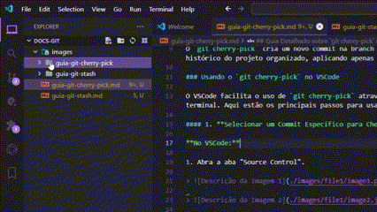

# Guia Detalhado sobre `git cherry-pick` no VSCode e CLI

### O que é o `git cherry-pick`?

O `git cherry-pick` permite aplicar commits específicos de uma branch em outra, sem precisar mesclar a branch inteira. Isso é útil para transferir mudanças seletivas, como correções de bugs ou melhorias, mantendo o histórico do projeto organizado.

### Como Funciona?

O `git cherry-pick` cria um novo commit na branch atual, copiando o conteúdo de um commit específico de outra branch. Isso permite aplicar mudanças precisas, sem incluir commits indesejados de uma branch inteira.

### Usando o `git cherry-pick` no VSCode

O VSCode facilita o uso de `git cherry-pick` através de sua interface gráfica, embora alguns passos ainda precisem ser realizados no terminal. Aqui estão os principais passos para usar o `git cherry-pick` no VSCode, com o equivalente no CLI.

#### 1. **Selecionar um Commit Específico para Cherry-Pick**

**No VSCode:**

1. Abra a aba "Source Control" (ícone de "ramos" na lateral esquerda).



2. Na guia de branches do Source Control, encontre o commit da outra branch que deseja aplicar na branch atual.


3. Clique com o botão direito no commit e selecione "Cherry-Pick Commit".


**Equivalente no CLI:**

```bash
git cherry-pick <commit-hash>
```

Substitua `<commit-hash>` pelo hash do commit que você quer aplicar na branch atual.

#### 2. **Aplicar uma Série de Commits**

**No VSCode:**

Atualmente, o VSCode não suporta diretamente a seleção de uma série de commits para cherry-pick através da interface gráfica. Essa operação precisa ser realizada no terminal.

**Equivalente no CLI:**

```bash
git cherry-pick <commit-hash-1>..<commit-hash-2>
```

Isso aplica todos os commits entre `<commit-hash-1>` e `<commit-hash-2>` na sua branch atual.

### Exemplo Prático

Suponha que você tenha duas branches: `feature` e `bugfix`. Você quer aplicar uma correção específica da branch `bugfix` na branch `feature`.

1. **Selecionar o Commit**

   Suponha que o hash do commit que você deseja aplicar da branch `bugfix` seja `a1b2c3d4`.

   **No VSCode:**

   - Vá para a aba "Source Control" e encontre o commit em "Commits" ou abrindo a seção "Branches".
   - Clique com o botão direito no commit e selecione "Cherry-Pick Commit".

   **Equivalente no CLI:**

   ```bash
   git checkout feature
   git cherry-pick a1b2c3d4
   ```

   Isso aplica o commit `a1b2c3d4` da branch `bugfix` na branch `feature`.

2. **Aplicar uma Série de Commits**

   Suponha que você queira aplicar todos os commits entre `a1b2c3d4` e `d4e5f6g7` da branch `bugfix` para a branch `feature`.

   **No VSCode:**

   - O VSCode não suporta diretamente a seleção de uma série de commits, então use o terminal para isso.

   **Equivalente no CLI:**

   ```bash
   git checkout feature
   git cherry-pick a1b2c3d4..d4e5f6g7
   ```

   Isso aplica todos os commits entre `a1b2c3d4` e `d4e5f6g7` na branch `feature`.

#### 3. **Lidar com Conflitos Durante o Cherry-Pick**

**No VSCode:**

1. Se houver conflitos, o VSCode destacará os arquivos conflitantes na aba "Source Control".
2. Resolva os conflitos manualmente usando as ferramentas de comparação do VSCode.
3. Após resolver os conflitos, adicione os arquivos ao index através da interface ou use o terminal.

**Equivalente no CLI:**

- **Resolver conflitos:**
  ```bash
  git add <arquivo>
  ```
- **Continuar o cherry-pick após resolver os conflitos:**
  ```bash
  git cherry-pick --continue
  ```

#### 4. **Abortar um Cherry-Pick**

**No VSCode:**

1. Se decidir abortar o cherry-pick, você precisará usar o terminal integrado do VSCode.

**Equivalente no CLI:**

```bash
git cherry-pick --abort
```

Isso cancela o cherry-pick e restaura a branch ao estado anterior.

### Comandos Úteis no CLI com Equivalentes no VSCode

- **Cherry-pick com edição de commit:**

  - **VSCode:** Atualmente, essa opção não está disponível diretamente.
  - **CLI:**
    ```bash
    git cherry-pick -e <commit-hash>
    ```

- **Cherry-pick sem criar um novo commit:**

  - **VSCode:** Não disponível diretamente na interface.
  - **CLI:**
    ```bash
    git cherry-pick --no-commit <commit-hash>
    ```

### Quando Usar o `git cherry-pick`?

- **Correções urgentes:** Quando você precisa aplicar uma correção de uma branch em outra rapidamente.
- **Mudanças seletivas:** Quando você deseja aplicar apenas algumas mudanças específicas sem mesclar toda a branch.

### Resumo

- **VSCode** facilita a aplicação de `git cherry-pick` para commits específicos através de sua interface gráfica.
- **CLI** oferece mais flexibilidade e controle, especialmente para operações mais complexas ou em série.

Use o `git cherry-pick` para manter seu fluxo de trabalho organizado, aplicando apenas as mudanças necessárias de uma branch para outra.