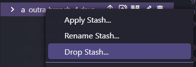

## Guia Detalhado sobre `git stash` no VSCode e CLI

### O que é o `git stash`?

O `git stash` é um comando do Git que salva temporariamente suas alterações no código para que você possa voltar ao último commit limpo. É útil quando você precisa interromper o trabalho atual, como trocar de branch, sem perder as alterações feitas até o momento.

### Como Funciona?

Quando você usa `git stash`, suas mudanças são armazenadas em uma pilha temporária. Essas alterações podem ser recuperadas posteriormente, permitindo que você continue seu trabalho de onde parou.

### Usando o `git stash` no VSCode

O Visual Studio Code (VSCode) integra funcionalidades do Git diretamente na interface gráfica, facilitando o uso de comandos como `git stash` sem precisar do terminal. Aqui estão os principais passos para usar o `git stash` no VSCode, com o equivalente no CLI (Command Line Interface).

#### 1. **Salvar Alterações (Stash)**

**No VSCode:**

1. Abra a aba "Source Control" no lado esquerdo (ícone de ramo).


2. Na parte superior, clique nos três pontinhos (...) para abrir o menu.


3. Selecione "Stash > Stash" para salvar suas alterações.


**Equivalente no CLI:**

```bash
git stash
```

Esse comando guarda todas as alterações e restaura seu diretório de trabalho ao último commit limpo.

#### 2. **Ver Stashes Salvas**

**No VSCode:**

1. Acesse a aba "Source Control".

2. Abaixo na lista da aba, temos outros controles, como o histórico de commits, branches e as stashes.


3. Ao abrir a guia stahes, aparecerá uma lista com as stashes armazenadas.


**Equivalente no CLI:**

```bash
git stash list
```

Este comando lista todas as stashes armazenadas, mostrando suas mensagens e identificadores.

#### 3. **Aplicar uma Stash**

**No VSCode:**

1. Na "Stash List", clique com o botão direito na stash desejada.

2. Selecione "Apply Stash" para aplicar as alterações na sua branch atual.


**Equivalente no CLI:**

```bash
git stash apply
```

Isso aplica a stash mais recente. Você pode especificar uma stash diferente com `git stash apply stash@{n}`.

#### 4. **Aplicar e Remover uma Stash**

**No VSCode:**

1. Na "Stash List", clique com o botão direito na stash desejada.
2. Selecione "Pop Stash" para aplicar e remover a stash.


**Equivalente no CLI:**

```bash
git stash pop
```

Isso aplica as mudanças e remove a stash da pilha.

#### 5. **Descartar uma Stash**

**No VSCode:**

1. Na "Stash List", clique com o botão direito na stash que deseja remover.
2. Selecione "Drop Stash" para removê-la sem aplicá-la.



**Equivalente no CLI:**

```bash
git stash drop
```

Este comando remove a stash especificada.

#### 6. **Limpar Todas as Stashes**

**No VSCode:**

1. Na "Stash List", use o menu de contexto para remover cada stash individualmente.
2. Atualmente, não há uma opção direta para limpar todas as stashes de uma vez no VSCode.

**Equivalente no CLI:**

```bash
git stash clear
```

Este comando remove todas as stashes armazenadas de uma vez.

### Comandos Úteis no CLI com Equivalentes no VSCode

- **Salvar apenas arquivos não adicionados ao index:**

  - **VSCode:** Não disponível diretamente na interface.
  - **CLI:**
    ```bash
    git stash --keep-index
    ```

- **Incluir arquivos não monitorados:**

  - **VSCode:** Não disponível diretamente na interface.
  - **CLI:**
    ```bash
    git stash -u
    ```

- **Criar uma branch a partir de uma stash:**

  - **VSCode:** Não disponível diretamente na interface.
  - **CLI:**
    ```bash
    git stash branch minha-branch
    ```

### Quando Usar o `git stash`?

- **Trocar de branch rapidamente** sem perder as alterações atuais.
- **Manter o histórico limpo** quando as alterações não estão prontas para um commit.

### Resumo

- **VSCode** oferece uma interface gráfica fácil para usar `git stash`, ideal para quem prefere evitar o terminal.
- **CLI** oferece flexibilidade e opções avançadas que nem sempre estão disponíveis no VSCode.

Use `git stash` no VSCode ou CLI conforme sua preferência, para manter seu fluxo de trabalho organizado e eficiente.